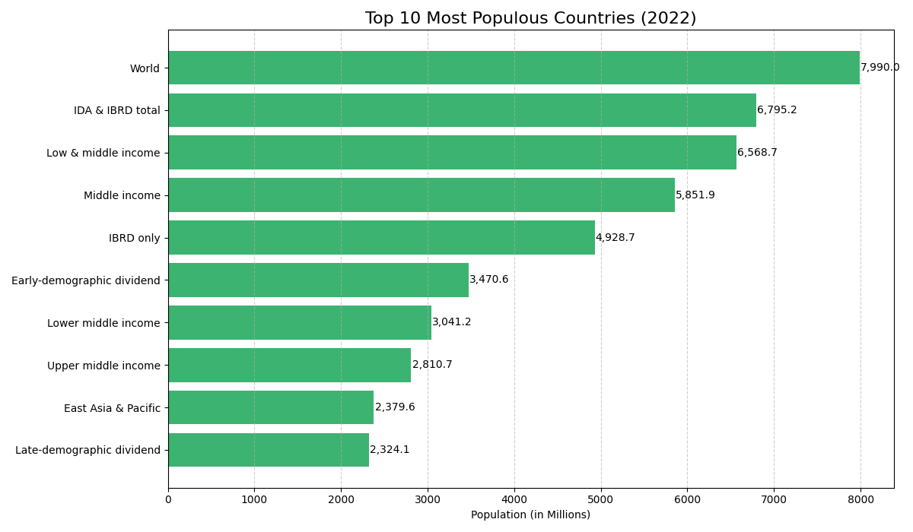

# PRODIGY_DS_01
Bar chart of most populated countries using World Bank data
# 🌍 Top 10 Most Populous Countries - 2022

This notebook visualizes population data from the World Bank to display the **Top 10 most populated countries** in 2022 using a horizontal bar chart.

## 📈 Chart Preview

## 📦 Files Included
- `population_visualization.ipynb` – Google Colab notebook
- `top10_population_2022.png` – Chart image
- `Dataset.csv` – Raw data (World Bank)

## 🧰 Tools Used
- Python
- Google Colab
- pandas
- matplotlib

## 🔗 Dataset Source
[World Bank - Total Population](https://data.worldbank.org/indicator/SP.POP.TOTL)

## 🚀 How to Use
1. Open the notebook in Colab or Jupyter
2. Upload `Dataset.csv`
3. Run the cell to regenerate the chart
